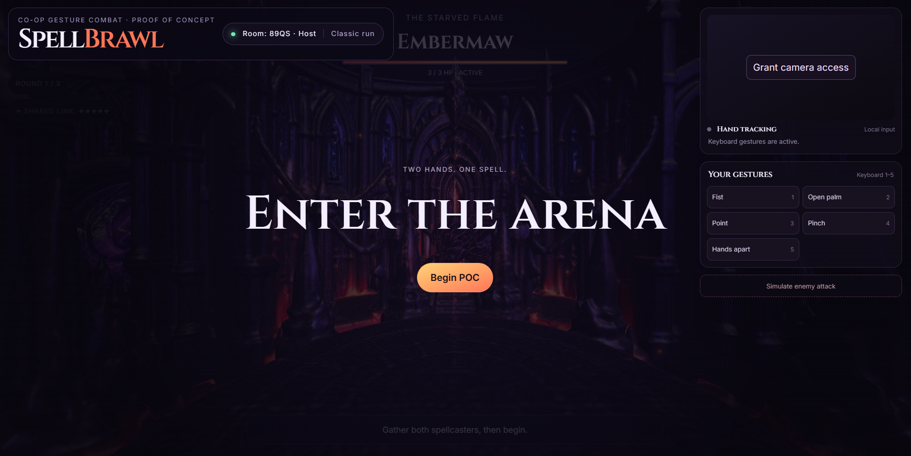

## The plan going forward:

### UI Changes

- Current UI: 
1. Only the title of the game "Spell Brawl", and the Room info should remain, everything else can be removed. From the picture, the game title card should not get in the way or obstruct the emeny info (the image shows that the game title card stretches further into the enemy info)

2. Remove the "Your Gestures" card as well as the "Simulate enemy attack" button.

3. We will now introduce a second hand tracking card for the other player (host is player 1 and the other player will be player 2). This card will show exactly what the other player is seeing on their hand tracking card as well.

4. This is now the complete game: remove the prototype naming and label the start button "Start".

5. Rename "Shared Link" to "Shared HP" and use a bar instead of diamonds to indicate shared player HP.

6. Add a button to exit the lobby that will disconnect the player and end the session for both players.

7. Hand tracking should be paused when the session ends. The hand tracking card should indicate that hand tracking is paused until the game begins.

8. On the right hand corner of the game screen add a move menu for the possible moves that each player can activate. See [Moves](MOVES.md). When a move is being used, the move should be highlighted with a glow (similar to how league of legends does it). When a move cannot be used for that round it should be disabled. See [Move Menu](C:\Users\bbdnet2399\Downloads\MoveMenu.png)

As can be seen from the menu, some moves have a timer, for those moves the menu item for that move should have a completition overlay indicating the length in which the players have to hold their gestures for it to be activated.

Extra note: The hand gesture images presented in the move menu image can be used in the hand tracking card in place of the text, that would improve the look of the game.

### Game Arena

- A player is represented in the scene by their camera
- The enemy stage is the circular platform at the center of each room

1. There will be two players in the arena, player 1 should be position on the left of the main enemy stage and player 2 on the right

2. When the players are low on HP, there should be an red overlay on both players' screens

### Move animations

1. Each of the moves in [Moves](MOVES.md) should have it's own 3d animation. If a move is a projectile e.g fireball, the player who's next to the player activating that move should see the projectile firing from that player's direction, even though the character of the player is not shown.

2. Each move has an effect when it lands on the enemy e.g fireball will cause an explosion when it hits the enemy but if the enemy is shielded it won't, the explosion will be less severe.

Some moves such as the Arcane shield surround both players with a green orb i.e the hue will change to green for both players while the shield is active.

Come up with animations and effects for all the moves with threejs

### Camera movements

1. When the player is idle, the camera should move every so slightly to the left and right.

2. When a player is hit by an enemy, the camera should shake and a red hue overlay should flash at each players' screen

3. When an enemy emerges and enters the room, the camera should shake like there's an earthquake

[There's probably some features I've left out or some potential improvements to this plan, please feel free add to/modify or this plan in order to include those. The goal is to create a fun and interactive complete game. As inspiration, you can look at the features that the League of Legends game has. As a complete game the Definition of Ready is defined in [24 hour plan](./spellbrawl-24-hour-plan.md)]
