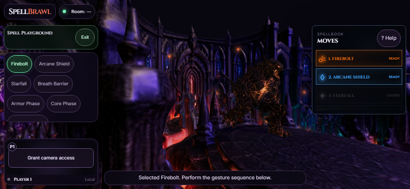
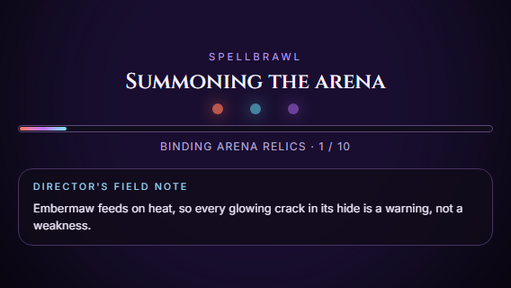
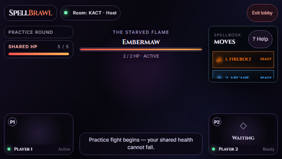

# Mobile landscape validation

The layout now uses compact side panels on short landscape screens and medium-width tablets. Spell lists scroll independently, camera previews use viewport-height limits, and combat messages occupy the space between the cameras. Startup and round loaders allow scrolling and use smaller vertical spacing on short screens so director notes remain readable. Viewport safe-area insets protect the compact layout from screen cutouts.

## Evidence

- Production build: `npm run build` passed (existing large-bundle warning remains).
- Playwright: **4 passed (28.6 seconds)**, Chromium, local Vite and room worker.
- Sizes: 568×320, 667×375, 844×390, 932×430, 1024×768, 1180×820, 1366×768; rotation to 390×844 and back. Existing portrait checks at 320×844, 390×844 and 760×844 also passed.
- Startup and round loader fixtures use the real components with incomplete asset progress and check that the entire field note is inside the viewport.
- Playground tests check panel bounds and separation, click all seven spells through scrolling, and open, scroll and close move help.
- Multiplayer test joins two clients through the local room worker, grants simulated camera readiness, starts the round, dismisses dialogue and checks HUD/camera separation across all landscape sizes.
- Full 3D playground separately loaded at 844×390 with real arena and monster assets; screenshot below.
- `git diff --check` passed.

Gameplay automation uses lightweight rendering and keyboard gestures; actual device cameras, iOS Safari, browser chrome resizing and physical display cutouts have not been tested. Automated loader content uses fallback field notes, not a live paid LLM call.

### Full 3D playground · 844×390

### Startup director note · 568×320

### Two-player combat layout · 568×320

