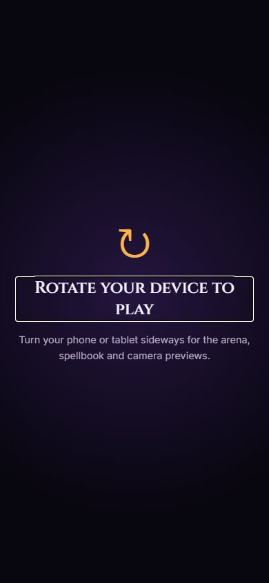
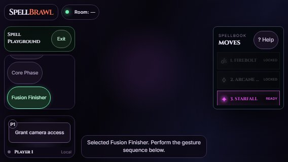

# Rotation prompt and touch controls validation

- Playwright: **5 passed (55.9s)** in Chromium against local Vite (5202) and room worker (8798).
- Production build: passed; existing bundle-size warning remains.
- `git diff --check`: passed.

Command:

```sh
node node_modules/@playwright/test/cli.js test --config tmp/playwright.config.ts e2e/rotate-prompt.spec.ts e2e/responsive.spec.ts
```

The temporary config uses the repository Playwright settings with one worker and the local Vite base URL.

The new startup test loads the real app and 3D assets with touch emulation at 390×844. It holds the arena GLB response beyond the loader's minimum duration and confirms the prompt remains absent. Once the asset is released, the loader disappears and the modal prompt appears. Escape does not dismiss it; rotating to 844×390 removes it and allows entering practice. Rotating to tablet portrait (768×1024) restores the prompt; landscape (1024×768) restores the existing playground session.

Touch tests at 568×320 and 844×390 confirm both spell panels are taller than before, the picker stays above the camera, all seven spell buttons are at least 44px tall and can be tapped after scrolling, and help can be opened and closed by tapping.

Existing responsive tests also passed across 568×320, 667×375, 844×390, 932×430, 1024×768, 1180×820 and 1366×768, including two-player lobby/combat separation, startup/round notes and desktop portrait rotation.

This follows the existing startup readiness definition: the initial arena and monster assets must be parsed. Audio preloading does not gate startup. The prompt covers portrait touch devices; it does not lock browser orientation or pause a multiplayer match. Physical-device Safari and cameras remain unverified.




